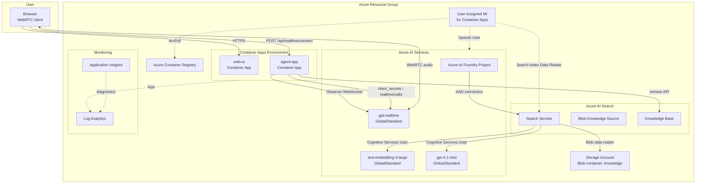

# GPT Realtime 1.5 Voice Help Desk

音声で問い合わせできるヘルプデスクアプリケーションです。アプリ本体は次の 2 つで構成されます。

- `web-ui`: React + Vite のブラウザアプリ。WebRTC で GPT Realtime 1.5 と音声セッションを張ります。
- `agent-app`: Node.js + Express のバックエンド。SDP を proxy し、Realtime セッションを observer 接続で監視して Azure AI Search knowledge base の tool call を実行します。

今回の構成では、Azure AI Services アカウント配下に Azure AI Foundry project を作成し、Foundry project から Azure AI Search を AAD 接続します。Realtime 音声そのものは引き続き Azure OpenAI resource endpoint を使い、knowledge retrieval だけを Azure AI Search knowledge base 経由に切り替えています。

## Azure アーキテクチャ構成図

`azd up` でデプロイされる Azure リソースと通信関係を示します。



## リソース一覧と役割

| リソース | 種類 | 役割 |
|---|---|---|
| **web-ui** | Container App | React SPA をブラウザに配信。Nginx がランタイム構成を注入 |
| **agent-app** | Container App | SDP プロキシ、Observer WebSocket、knowledge base tool execution |
| **Azure AI Services** | Cognitive Services | Realtime、embedding、knowledge base answer synthesis 用のモデルをホスト |
| **Azure AI Foundry Project** | Project | Search connection を持つ Foundry project。運用上の接続管理とガバナンスに使用 |
| **Azure AI Search** | Search Service | Blob knowledge source と knowledge base をホスト |
| **Azure Storage** | Storage Account | `knowledge` Blob コンテナにドキュメントを格納 |
| **Azure Container Registry** | Container Registry | agent-app / web-ui の Docker イメージを格納 |
| **Managed Identities** | Managed Identity | Container Apps の RBAC 実行主体 |
| **Log Analytics / App Insights** | Monitoring | ログ収集と診断 |

## 通信フローの概要

1. ブラウザが `web-ui` を読み込み、`agent-app` の `/api/realtime/connect` へ SDP Offer を送信します。
2. `agent-app` は Azure OpenAI resource endpoint の `client_secrets` と `realtime/calls` API を使って WebRTC を中継します。
3. ブラウザは Azure OpenAI の Realtime deployment と直接音声を送受信します。
4. `agent-app` は observer WebSocket (`wss://.../openai/v1/realtime?call_id=...`) でセッションを監視します。
5. モデルが `search_knowledge_base` を呼ぶと、`agent-app` は Azure AI Search knowledge base の `retrieve` API を呼び、answer と references を `function_call_output` として返します。
6. Azure AI Search は Blob knowledge source から生成した indexer pipeline を使って `knowledge` コンテナを取り込みます。

## RBAC

| プリンシパル | スコープ | ロール |
|---|---|---|
| Container Apps 用 User Assigned MI | Azure Container Registry | AcrPull |
| Container Apps 用 User Assigned MI | Azure AI Services | Cognitive Services OpenAI User |
| Container Apps 用 User Assigned MI | Azure AI Search | Search Index Data Reader |
| Azure AI Search の System MI | Azure Storage | Storage Blob Data Reader |
| Azure AI Search の System MI | Azure AI Services | Cognitive Services OpenAI User |
| Azure AI Foundry Project の System MI | Azure AI Search | Search Index Data Reader |

## ディレクトリ構成

```text
.
├── agent-app/
├── infra/
├── web-ui/
├── docker-compose.yml
└── plan.md
```

## 前提条件

- `azd`
- `az`
- Docker または ACR remote build を使える権限
- Azure に Realtime / Search / Storage / Container Apps をデプロイできる権限

## ローカル実行

### 1. バックエンド

```bash
cd agent-app
cp .env.example .env
npm install
npm run dev
```

ローカルで Azure リソースを用意していない場合は `MOCK_SEARCH=true` のまま使えます。

### 2. フロントエンド

```bash
cd web-ui
cp .env.example .env
npm install
npm run dev
```

### 3. ブラウザで確認

- Web UI: http://localhost:5173
- Agent App health check: http://localhost:8080/health

## Docker での起動

```bash
docker compose up --build
```

`agent-app/.env` は事前に作成しておく必要があります。

## 実装の要点

- ブラウザは `RTCPeerConnection` で音声を送受信します。
- `agent-app` は Azure OpenAI resource endpoint の `client_secrets` と `realtime/calls` を使って SDP を中継します。
- `agent-app` は `wss://.../openai/v1/realtime?call_id=...` に observer 接続します。
- tool `search_knowledge_base` は Azure AI Search knowledge base の `retrieve` API を呼び、answer と references をまとめて返します。
- `GET /api/search/probe` は Azure AI Search knowledge base の `retrieve` を 1 回実行して、疎通確認用の結果を返します。
- Foundry project は Search との AAD connection を持ちますが、Realtime 音声 API 自体は Foundry project endpoint ではなく Azure OpenAI resource endpoint を使います。

## Azure OpenAI / Foundry 設定値

`AZURE_OPENAI_ENDPOINT` には Azure AI Services アカウントの endpoint をそのまま指定します。

例:

```dotenv
AZURE_OPENAI_ENDPOINT=https://admin-2781-resource.cognitiveservices.azure.com
```

knowledge retrieval には次の env を使います。

```dotenv
AZURE_SEARCH_ENDPOINT=https://<search-service>.search.windows.net
AZURE_SEARCH_KNOWLEDGE_BASE=helpdesk-kb
AZURE_SEARCH_KNOWLEDGE_SOURCE=helpdesk-blob-ks
AZURE_SEARCH_API_VERSION=2025-11-01-preview
```

疎通確認は次のように実行できます。

```bash
curl "http://localhost:8080/api/search/probe"
curl "http://localhost:8080/api/search/probe?query=VPN%20%E3%81%8C%E7%B9%8B%E3%81%8C%E3%82%89%E3%81%AA%E3%81%84"
```

成功時は `answer`、`results`、`resultCount`、および実際に使った Search 設定値を JSON で返します。`MOCK_SEARCH=true` の場合も同じエンドポイントでモック応答を確認できます。

## azd でのデプロイ

### 1. 環境作成

```bash
azd env new <environment-name>
azd env set AZURE_LOCATION swedencentral
```

### 2. パラメータ確認

`infra/main.parameters.json` または `infra/main.bicepparam` の次の値を必要に応じて更新してください。

- `openAiRealtimeModelName`
- `openAiRealtimeModelVersion`
- `openAiEmbeddingCapacity`
- `openAiEmbeddingModelVersion`
- `openAiChatModelName`
- `openAiChatModelVersion`
- `foundryProjectName`
- `knowledgeSourceName`
- `knowledgeBaseName`
- `mockSearch`

既定値では、realtime モデルに `gpt-realtime` / `2025-08-28`、knowledge base 用 chat モデルに `gpt-4.1-mini` / `2025-04-14`、embedding に `text-embedding-3-large` / `1` を使い、embedding deployment capacity は `882` を使います。

### 3. デプロイ

```bash
azd up
```

`azd` は次を実行します。

- `infra/main.bicep` で Azure リソースを作成
- Azure AI Foundry project と Search connection を作成
- postprovision hook で Blob knowledge source と knowledge base を作成
- `agent-app` と `web-ui` の Dockerfile を ACR remote build で build
- Container Apps の placeholder image を実アプリ image に更新

### 4. ナレッジドキュメントの投入

デプロイ時点で `knowledge` コンテナにドキュメントが無い場合、knowledge source は空の状態で作成されます。Blob を追加した後に再度 provisioning を流してください。

```bash
azd provision
```

これで postprovision hook が再実行され、knowledge source / knowledge base を同じ名前で再適用します。ストレージアカウント名とコンテナ名は `azd up` の outputs として確認できます。

## 補足

- `web-ui` は `runtime-config.js` を使って実行時に Agent App の URL を読むため、先に Agent App の URL が確定していなくても `azd up` を 1 回で実行できます。
- Azure AI Search knowledge source / knowledge base は preview API を使っているため、`azd` の postprovision hook から `infra/scripts/provision-search-kb.sh` を実行して data plane object を作成しています。
- `MOCK_SEARCH=true` にすると backend は Search を呼ばずモック応答を返します。
