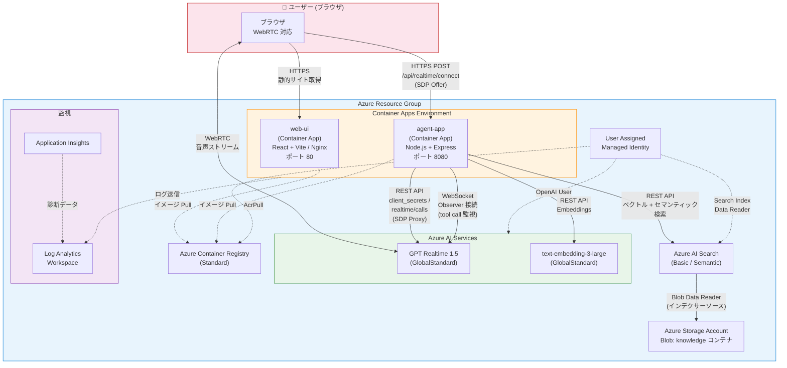

# GPT Realtime 1.5 Voice Help Desk

音声で問い合わせできるヘルプデスクアプリケーションです。構成は次の 2 つです。

- `web-ui`: React + Vite のブラウザアプリ。WebRTC で GPT Realtime 1.5 と音声セッションを張ります。
- `agent-app`: Node.js + Express のバックエンド。SDP を proxy し、Realtime セッションを observer 接続で監視して Azure AI Search の tool call を実行します。

## Azure アーキテクチャ構成図

`azd up` でデプロイされる Azure リソースと通信関係を示します。



### リソース一覧と役割

| リソース | 種類 | 役割 |
|---|---|---|
| **web-ui** | Container App | React SPA をブラウザに配信。Nginx がランタイム構成を注入 |
| **agent-app** | Container App | SDP プロキシ、Observer WebSocket による tool call 実行、RAG 検索 |
| **Azure AI Services** | Cognitive Services | GPT Realtime 1.5 (音声) と text-embedding-3-large (埋め込み) をホスト |
| **Azure AI Search** | Search Service | ナレッジベースのベクトル＋セマンティック検索を提供 |
| **Azure Storage** | Storage Account | `knowledge` Blob コンテナにドキュメントを格納 (AI Search のデータソース) |
| **Azure Container Registry** | Container Registry | agent-app / web-ui の Docker イメージを格納 |
| **User Assigned Managed Identity** | Managed Identity | Container Apps が各サービスにアクセスするための RBAC ID |
| **Log Analytics / App Insights** | 監視 | ログ収集と診断 |

### 通信フローの概要

1. **ブラウザ → web-ui**: HTTPS で React SPA を取得
2. **ブラウザ → agent-app**: `/api/realtime/connect` へ SDP Offer を POST
3. **agent-app → Azure OpenAI**: `client_secrets` → `realtime/calls` API で SDP を中継し、Answer SDP をブラウザに返却
4. **ブラウザ ↔ Azure OpenAI**: WebRTC で音声をリアルタイム送受信
5. **agent-app → Azure OpenAI**: Observer WebSocket (`wss://…/realtime?call_id=…`) でセッションを監視
6. **モデルが tool call を発行** → agent-app が Azure AI Search を検索 → `function_call_output` を返却
7. **Azure AI Search → Storage**: インデクサーが Blob からドキュメントを読み取り

### RBAC (ロール割り当て)

| プリンシパル | スコープ | ロール |
|---|---|---|
| User Assigned Managed Identity | Azure Container Registry | AcrPull |
| User Assigned Managed Identity | Azure AI Services | Cognitive Services OpenAI User |
| User Assigned Managed Identity | Azure AI Search | Search Index Data Reader |
| Azure AI Search (System Identity) | Azure Storage | Storage Blob Data Reader |

## ディレクトリ構成

```text
.
├── agent-app/
├── web-ui/
├── docker-compose.yml
└── plan.md
```

## 前提条件

- Azure OpenAI リソース
- GPT Realtime 1.5 のデプロイ
- Azure AI Search インデックス
- Azure CLI でのログイン、または Container Apps 上の Managed Identity

## ローカル実行

### 1. バックエンドの設定

```bash
cd agent-app
cp .env.example .env
npm install
npm run dev
```

### 2. フロントエンドの設定

```bash
cd web-ui
cp .env.example .env
npm install
npm run dev
```

### 3. ブラウザで開く

- Web UI: http://localhost:5173
- Agent App health check: http://localhost:8080/health

## Docker での起動

```bash
docker compose up --build
```

`agent-app/.env` は事前に作成しておく必要があります。

## 実装の要点

- ブラウザは `RTCPeerConnection` で音声を送受信
- ブラウザは SDP Offer を `agent-app` の `/api/realtime/connect` に送信
- `agent-app` は Azure OpenAI の `client_secrets` と `realtime/calls` を使って接続を中継
- `agent-app` は `wss://.../openai/v1/realtime?call_id=...` に observer 接続
- モデルが `search_knowledge_base` を呼ぶと、Azure AI Search を検索して `function_call_output` を返却

## Azure OpenAI / Foundry 設定値

`AZURE_OPENAI_ENDPOINT` にはリソース名ではなく Target URI をそのまま入れます。

例:

```dotenv
AZURE_OPENAI_ENDPOINT=https://admin-2781-resource.cognitiveservices.azure.com
```

Azure AI Search がまだ無い場合は、`MOCK_SEARCH=true` でモック応答に切り替えられます。

## azd でのデプロイ

このリポジトリは `azd up` に対応しています。

### 前提

- `azd`
- `Azure CLI`
- Docker または ACR remote build を使える権限

### 1. 環境作成

```bash
azd env new <environment-name>
azd env set AZURE_LOCATION eastus2
```

### 2. パラメータ確認

`infra/main.parameters.json` の次の値を必要に応じて更新してください。

- `openAiRealtimeModelName`
- `openAiRealtimeModelVersion`
- `openAiEmbeddingModelVersion`
- `mockSearch`

既定値では、`azd up` の ARM 検証を通る組み合わせとして realtime モデルに `gpt-realtime` / `2025-08-28` を使っています。`gpt-realtime-1.5-2026-02-23` は docs 上は利用可能モデルですが、この時点では少なくとも本サブスクリプションの ARM 検証で `DeploymentModelNotSupported` になりました。

### 3. デプロイ

```bash
azd up
```

`azd` は次を実行します。

- `infra/main.bicep` で Azure リソースを作成
- `agent-app` と `web-ui` の Dockerfile を ACR remote build で build
- Container Apps の placeholder image を実アプリ image に更新

`web-ui` は `runtime-config.js` を使って実行時に Agent App の URL を読むため、先に Agent App の URL が確定していなくても `azd up` を 1 回で実行できます。

## 次の実装候補

- 検索結果の citation 表示
- 会話履歴の永続化
- Blob Storage からの indexer 自動構築
